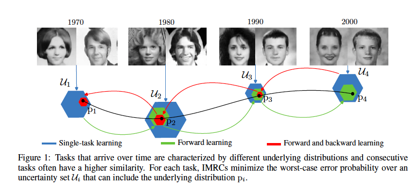

# Minimax Forward and Backward Learning of Evolving Tasks with Performance Guarantees (IMRC)

[](/AMRC_Python) [](/AMRC_Matlab)  [](#support-and-author)

This repository is the official implementation of Minimax Forward and Backward Learning of Evolving Tasks with Performance Guarantees.

The proposed IMRCs effectively perform forward and backward learning and account for evolving tasks.



## Source code

[](CL-MRC_Python) 
[](CL-MRC_Matlab)

IMRC folder contains the Python and Matlab folders that include the Python and Matlab scripts, respectively, required to run the code.

### Python code

[IMRC_ Python](/CL-MRC_Python) folder contains Python scripts required to execute the method:

* run_IMRC.py is the main file. In such file we can modify the values of hyper-parameters such as  , the order, and the feature mapping. In addition, such function tracks uncertainty sets, provides performance guarantees at specific times, and updates classifier parameters.
* efficient_learning.py updates classifier parameters.
* prediction.py assigns label to instances.
* feture_mapping_function.py calculates feature vectors using linear or random Fourier features (RFF) feature mappings.
* forward_backward_learning.py contains functions that obtain mean vector estimates and confidence vectors for single-task, forward, and forward and backward learning.
* requeriments.txt contains versions of Python modules


#### Requirements

The requirements are detailed in the requeriments.txt file. Run the following command to install the requeriments:

```setup
cd 
/IMRC_Python
pip install -r requirements.txt
```

### Matlab code

[IMRC_Matlab](/CL-MRC_Matlab) folder contains Matlab scripts required to execute the method:

* main.m is the main file. In such file we can modify the values of the hyper-parameters and the feature mapping.
* initialize.m initializes model variables.
* single_task.m obtains mean vector estimates, confidence vectors, and classifier parameters with single-task learning.
* forward.m obtains mean vector estimates, confidence vectors, and classifier parameters with forward learning.
* backward.m obtains mean vector estimates, confidence vectors, and classifier parameters with forward and backward learning.
* feature_vector.m calculates feature vectors using linear or random Fourier features (RFF) feature mappings.
* optimization.m updates classifier parameters.
* prediction.m assigns label to instances.

## Installation and evaluation

To train and evaluate the model in the paper, run this command for Python:

```console
cd IMRC/IMRC_Python
python run_IMRC.py

```

and for Matlab:

```console
cd IMRC/IMRC_Matlab
matlab main.m
```
## Support and Author

Verónica Álvarez

valvarez@bcamath.org

[](https://github.com/VeronicaAlvarez)

## License 

IMRCs carry a MIT license.

## Citation

If you find useful the code in your research, please include explicit mention of our work in your publication with the following corresponding entry in your bibliography:

<a id="1">[1]</a> 
V. Alvarez, S. Mazuelas, J.A. Lozano.
"Minimax forward and backward learning of evolving tasks with performance guarantees." In Advances in Neural Information Processing Systems, 2023.

The corresponding BiBTeX citation is given below:
